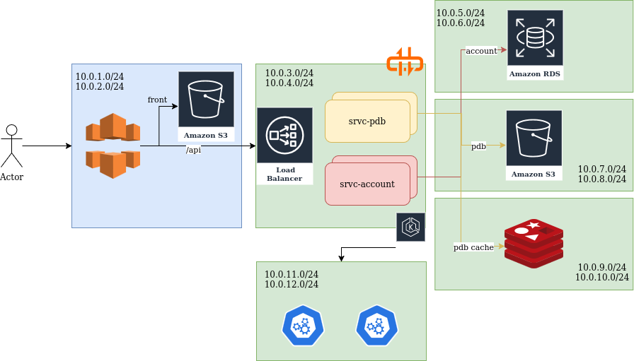

# GFP

Small project deploying EKS with a microservice architecture.

The goal is to build a platform to register molecules and proteins for visualization using multiple known format including SMILES / PDB ...

